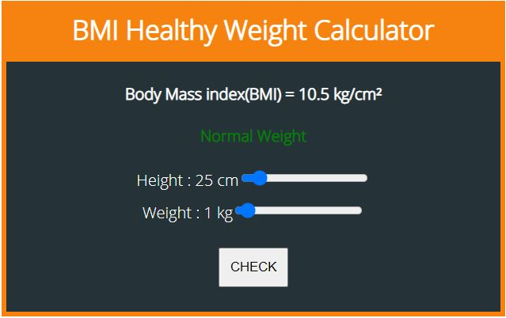

# BMI CALCULATOR

> Project build on reactjs

## User interface

## Uses

 In the project directory ,run:
###  `npm install`

###  `npm start`

Runs the app in the development mode.\
Open [http://localhost:3000](http://localhost:3000) to view it in the browser.

